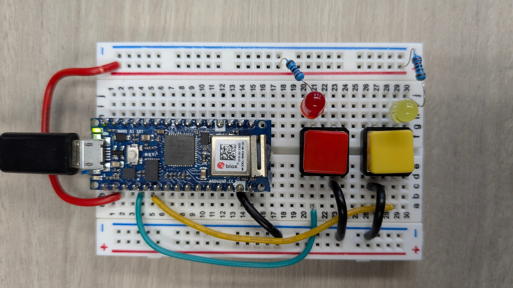

# 🔌 Arduino IoT — Moniteur de boutons / Button Monitor


> 🇫🇷 Projet IoT complet : une carte Arduino Nano 33 IoT lit deux boutons et envoie leur état en HTTP/JSON vers un serveur PHP qui persiste les données en MySQL et les affiche en temps réel.
>
> 🇬🇧 Full IoT pipeline: an Arduino Nano 33 IoT reads two buttons and sends their state via HTTP/JSON to a PHP server that persists data in MySQL and displays it in real time.

> 📚 Examen 1 — Cours d'environnements IoT, session Hiver 2026
> 👤 Leandre Kanmegne

---

## 📸 Aperçu / Preview

<p float="left">
  
  
  
</p>

## 📖 Description

### 🇫🇷 Chaîne IoT complète

```
🔴🟡 Boutons physiques
      ↓
📡 Arduino Nano 33 IoT (Wi-Fi)
      ↓ HTTP POST JSON
🖥️  Serveur PHP (Raspberry Pi / VPS)
      ↓
🗄️  MySQL — historique des états
      ↓
🌐 Interface web — 5 derniers événements
```

### 🇬🇧 Full IoT Pipeline

```
🔴🟡 Physical buttons
      ↓
📡 Arduino Nano 33 IoT (Wi-Fi)
      ↓ HTTP POST JSON
🖥️  PHP Server (Raspberry Pi / VPS)
      ↓
🗄️  MySQL — state history
      ↓
🌐 Web interface — last 5 events
```

---

## ✨ Features / Fonctionnalités

| 🇫🇷 | 🇬🇧 |
|---|---|
| 🔴🟡 Lecture de 2 boutons (rouge & jaune) | 🔴🟡 2-button reading (red & yellow) |
| 📡 Envoi HTTP/JSON sur changement d'état | 📡 HTTP/JSON POST on state change |
| 💡 LED interne clignotante à chaque envoi | 💡 Built-in LED blink on each send |
| 🗄️ Persistance MySQL horodatée + IP client | 🗄️ Timestamped MySQL persistence + client IP |
| 🌐 Affichage des 5 derniers événements | 🌐 Display of last 5 events |
| 🔒 Restriction d'accès par IP (Caddy) | 🔒 IP-based access restriction (Caddy) |
| 📋 Logs serveur détaillés | 📋 Detailed server logs |

---

## 🔧 Matériel requis / Hardware Requirements

| Composant / Component | Détail / Detail |
|---|---|
| 🤖 Arduino **Nano 33 IoT** | Module Wi-Fi u-blox NINA-W102 |
| 🔴 Bouton rouge / Red button | PIN 14 — `INPUT_PULLUP` |
| 🟡 Bouton jaune / Yellow button | PIN 15 — `INPUT_PULLUP` |
| 💡 LEDs rouge & jaune | Indicateurs visuels / Visual indicators |
| ⚡ Résistances / Resistors | Pull-up internes utilisées / Internal pull-ups used |
| 🔌 Breadboard + câbles / jumper wires | |

---

## 🏗️ Structure du projet / Project Structure

```
📦 Arduino_IOT
├── 📁 Documents/Arduino/
│   └── examen1_komkanmegneleandrejunior.ino  → Sketch Arduino
├── 📁 examen1_komkanmegneleandrejunior/
│   ├── index.php                             → Interface web / Web UI
│   ├── boutons.php                           → API endpoint (réception JSON)
│   ├── 📁 css/                               → Styles
│   └── 📁 errors/                            → Pages d'erreur / Error pages
├── 🗄️  creation_db_examen1.sql               → Schéma DB / DB schema
├── 📊 historisation_examen1.sql              → Requêtes stats / Stats queries
└── ⚙️  Caddyfile                              → Config serveur / Server config
```

---

## 🌐 API Endpoint

| Méthode | Route | Description |
|---|---|---|
| `POST` | `/boutons.php` | Reçoit l'état JSON des boutons / Receives button state JSON |

**Payload JSON :**
```json
{
  "bouton_rouge": true,
  "bouton_jaune": false
}
```

**Réponse / Response :**
```json
{ "status": "ok", "message": "Enregistrement reussi" }
```

---

## 🗄️ Base de données / Database

**Table `boutons` :**

| Champ / Field | Type | Description |
|---|---|---|
| `id` | INT AUTO_INCREMENT | Identifiant / ID |
| `etat_bouton_rouge` | TINYINT(1) | 1 = Appuyé / Pressed |
| `etat_bouton_jaune` | TINYINT(1) | 1 = Appuyé / Pressed |
| `adresse_ip` | VARCHAR(45) | IP de l'Arduino / Arduino IP |
| `date_heure` | DATETIME | Horodatage / Timestamp |

---

## 🚀 Installation

### 🇫🇷 Côté Arduino
1. Ouvrir le sketch dans **Arduino IDE 2.x**
2. Installer les librairies : `WiFiNINA`, `ArduinoHttpClient`, `ArduinoJson`
3. Configurer le SSID Wi-Fi et l'IP du serveur dans le sketch
4. Flasher sur la carte **Arduino Nano 33 IoT**

### 🇬🇧 Arduino Side
1. Open the sketch in **Arduino IDE 2.x**
2. Install libraries: `WiFiNINA`, `ArduinoHttpClient`, `ArduinoJson`
3. Set Wi-Fi SSID and server IP in the sketch
4. Flash to **Arduino Nano 33 IoT**

### 🇫🇷 Côté serveur
```bash
# Initialiser la base de données / Initialize the database
mysql -u root -p < creation_db_examen1.sql

# Déployer les fichiers PHP dans le dossier web
# Deploy PHP files to the web folder
cp -r examen1_komkanmegneleandrejunior/ /var/www/

# Démarrer Caddy / Start Caddy
caddy run --config Caddyfile
```

---

## 👤 Auteur / Author

**Leandre Kanmegne** — [GitHub](https://github.com/Leandre02)